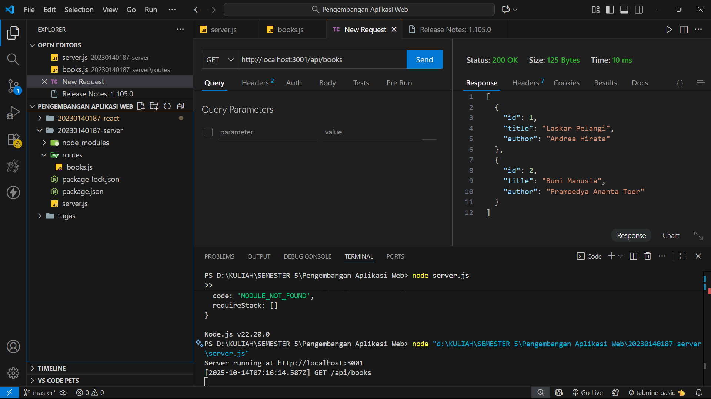
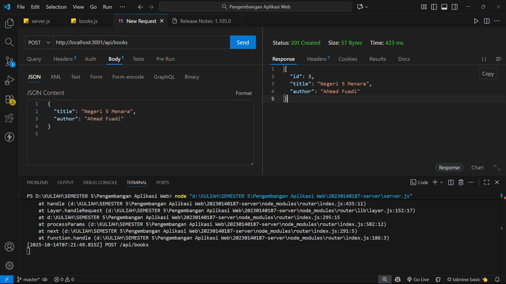
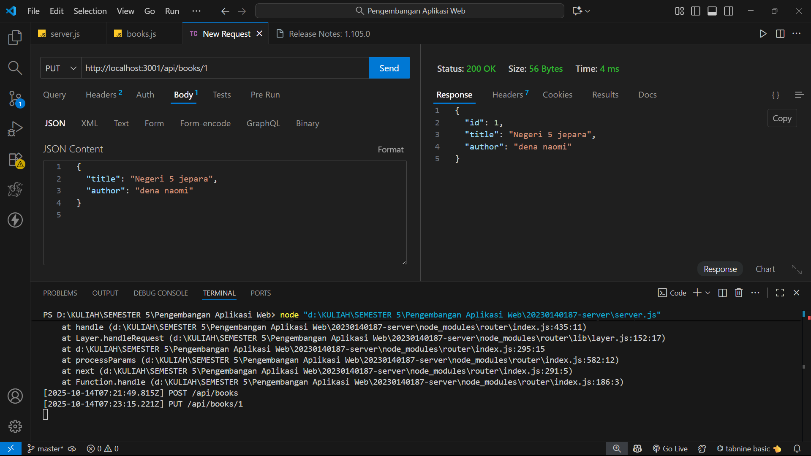
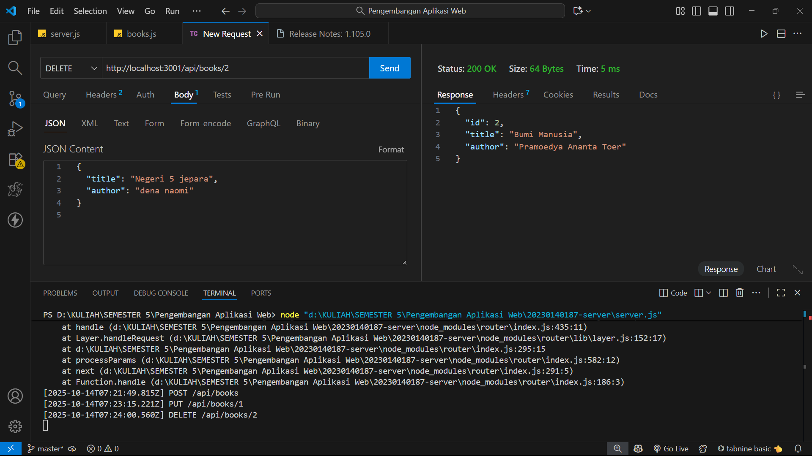

# Tugas 2 - Express.js CRUD Buku Perpustakaan

- **Nama:** Irfan Afifuddin
- **NIM:** 20230140187
- **Kelas:** D
## Endpoint CRUD

### 1. GET /api/books

### 2. GET /api/books/:id

### 3. POST /api/books

### 4. PUT /api/books/:id

### 5. DELETE /api/books/:id

### 6.  AFTER DELETE /api/books/:id
