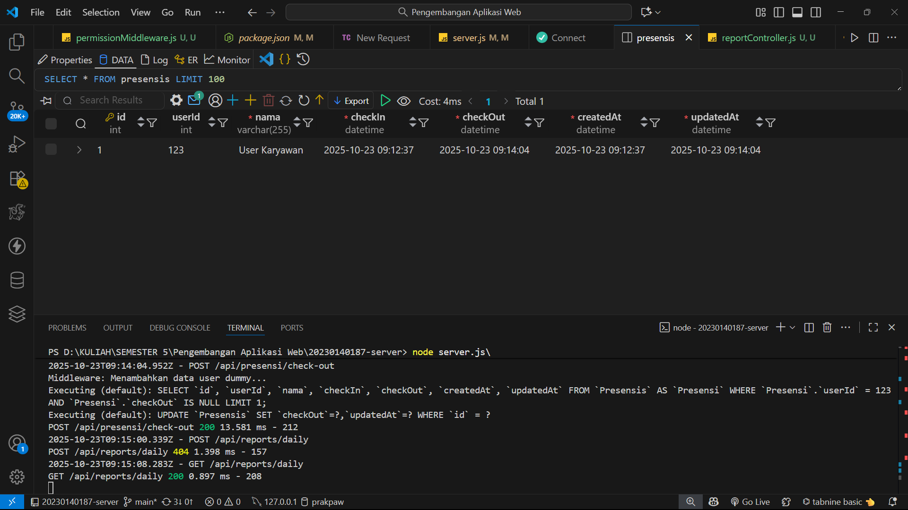

# Tugas 5 - RESTful API Presensi (Update, Delete, Search)

- *Nama:* Irfan Afifuddin  
- *NIM:* 20230140187  
- *Kelas:* D

## Endpoint Presensi & Reports

### 1. PUT /api/presensi/:id  

### 2. PUT /api/presensi/:id (Format Tanggal Tidak Valid)  

### 3. DELETE /api/presensi/:id  

### 4. GET /api/reports/daily?nama=User  

### 5. GET /api/reports/daily?tanggalMulai=2025-10-01&tanggalSelesai=2025-10-31  

### 6. DATABASE  

